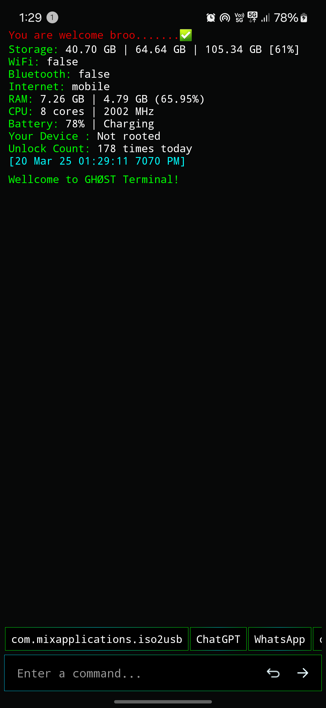
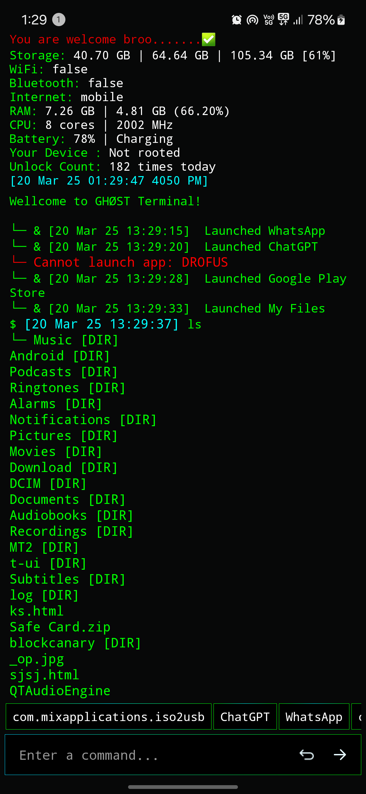
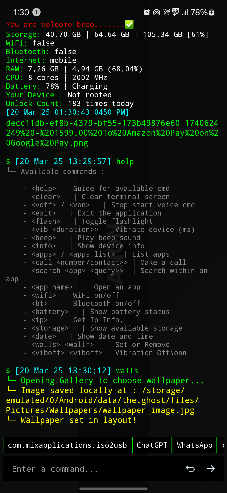

# 🖤 Hacking Theme Android Terminal 🖤

Welcome to the **Hacking Style Android Terminal** — a powerful, stylish, and lightweight terminal app designed with a hacker's vibe. Feel the power of hacking right on your Android screen!

## 🚀 Features
- Dark hacking theme with green terminal text
- Fast, smooth, and responsive performance
- Basic Linux/Unix style commands supported
- Lightweight and optimized for all Android devices
- Real-time device info display
- App launching and system controls
- Clean hacker-style user interface

## 📖 Help Commands & Usage

| Command                  | Description                          |
|--------------------------|--------------------------------------|
| `help`                   | Show available commands              |
| `clear`                  | Clear terminal screen                |
| `voff` / `von`           | Stop / Start voice command           |
| `exit`                   | Exit the terminal                    |
| `flash`                  | Toggle flashlight                    |
| `vib <duration>`         | Vibrate device (ms)                  |
| `beep`                   | Play beep sound                      |
| `info`                   | Show device information              |
| `apps` / `apps list`     | List installed apps                  |
| `call <number/contact>`  | Make a call                          |
| `search <app> <query>`   | Search inside any app                |
| `<app name>`             | Open a specific app                  |
| `wifi`                   | Toggle WiFi on/off                   |
| `bt`                     | Toggle Bluetooth on/off             |
| `battery`                | Show battery status                  |
| `ip`                     | Get IP information                   |
| `storage`                | Show available storage               |
| `date`                   | Display date and time                |
| `walls` / `wallr`        | Set or remove wallpaper              |
| `viboff`                 | Stop vibration                       |

✅ **Example Usage:**  
- `call 1234567890` → Makes a call  
- `search WhatsApp Hello` → Search *Hello* inside WhatsApp  
- `walls` → Set wallpaper

---

## 🖼️ Screenshots (Interface Preview)

| Screenshot 1                           | Screenshot 2                           | Screenshot 3                           |
|----------------------------------------|----------------------------------------|----------------------------------------|
|  |  |  |

*Screenshots represent the actual terminal interface.*

---

## 📥 Release Download
👉 **Download Latest Release APK**:  
[🔗 Download Now](https://github.com/harik90/Ghost-Tereminal/releases/download/hackingui/Ghost.Terminal.apk)  

*Click the link above to download the latest version of the Hacking Theme Android Terminal APK.*

---

## 📜 License
 - MIT License

Copyright (c) 2025

Permission is hereby granted, free of charge, to any person obtaining a copy of this software and associated documentation files (the "Software"), to deal in the Software without restriction, including without limitation the rights to use, copy, modify, merge, publish, distribute, sublicense, and/or sell copies of the Software.

---
